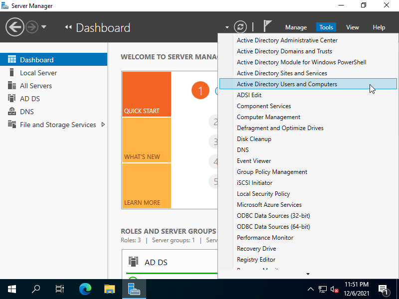
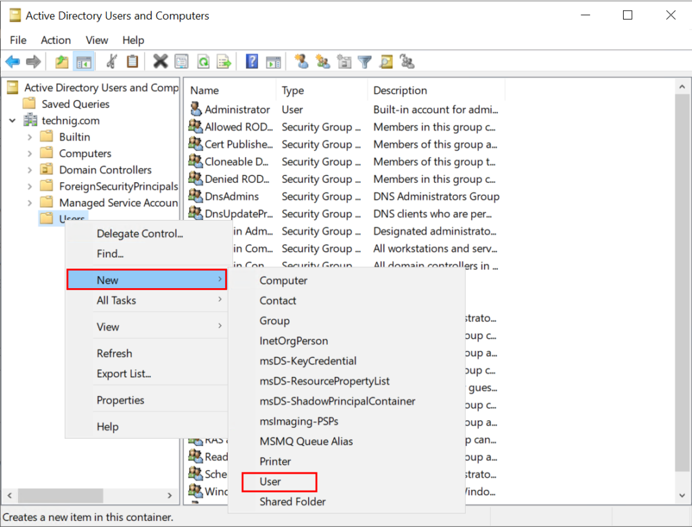
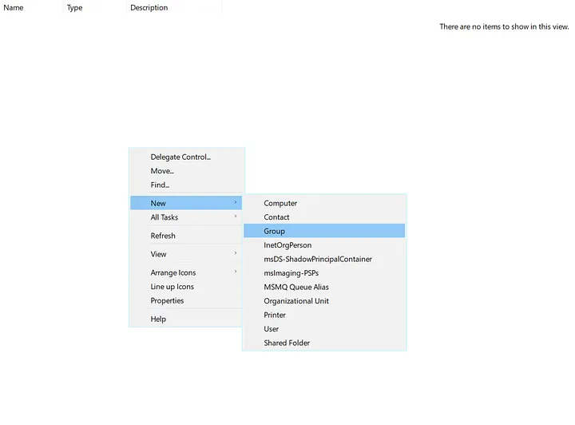
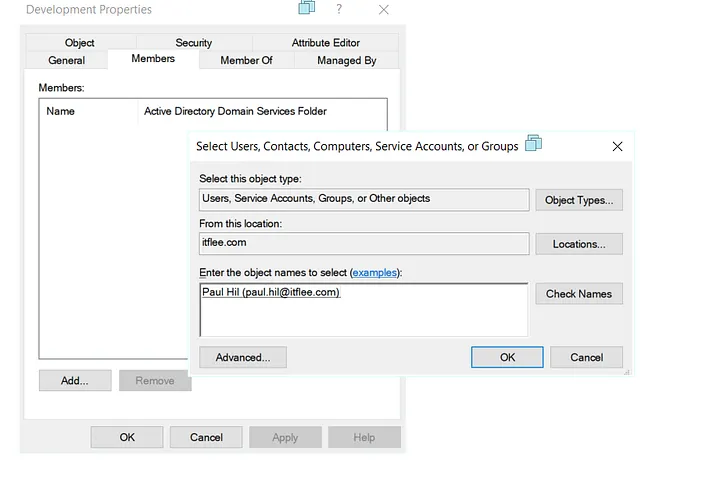
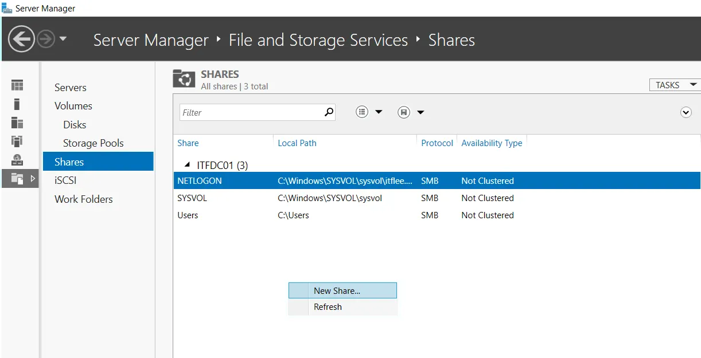
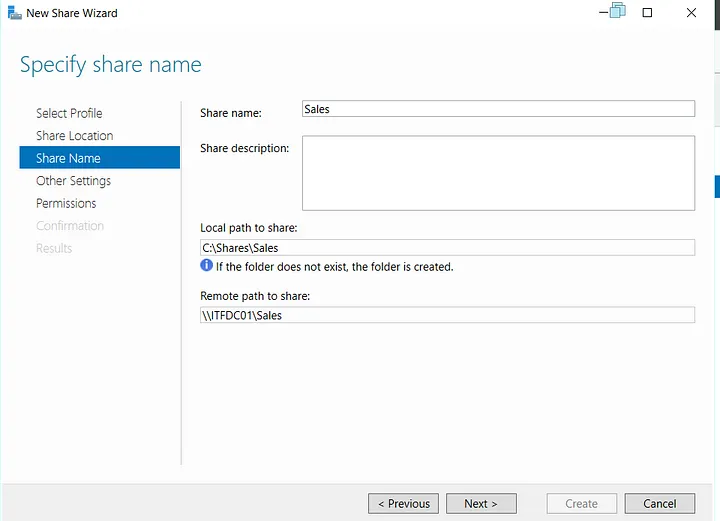
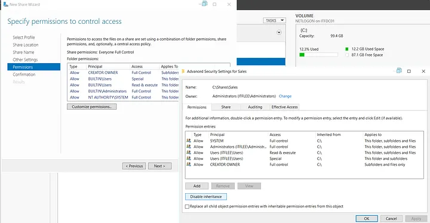
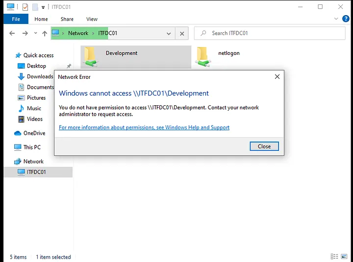

# Veiledning i active directory

## Viktige begreper å vite
- GPO, GPO eller group policy, er et sett med rettigheter som kan designeres til OU eller spesifike brukere.
- OU, OU eller orginasational units er laveste nivås gruppering, som vil at det er ingenting som grupperer OU, det er her du vil designere Group policies 

---

## Hvordan sette opp bruker
For å sette opp en bruker i acitve directory må du først navigere til ``Active Directory Users and Computers console``

Når du har gått inne på denne menyen vil et nytt vindu poppe opp, der du kan høyre klikke på mappen du vil legge brukeren til i, så velger du ``new`` også ``user``

Du vil nå få opp en popup vindu der du kan administrere: 
- Fornavn: (optional)
- Navn forkortning: (optional)
- Etternavn (optional)
- Fullt navn (nødvendig)
- Brukernavn (nødvendig)

- Passord ved login
- Om bruker må skifte passord neste gang en logger inn
- Om bruker kan skifte passord
- Om passordet må oppdateres etterhvert
- Om brukeren er deaktivert

---

## Hvordan administrere mappe-tilgang og filnivå
For å kunne administrere må du først oprette grupper. Dette gjør du ved å høyreklikke og trykke new også group

legg så til medlemmer

Åpne så ``File and storage Services`` og legg til en ny share ved å høyre klikke og trykke ``new share``

Velg hvilkene mapper du vil at brukeren ikke skal ha tilgang til

Velg hvilken gruppe du vil ikke skal ha tilgang til mappen

Klikk ``Create``. Nå vil brukeren ikke ha tilgang til mappen du spesifiserte

